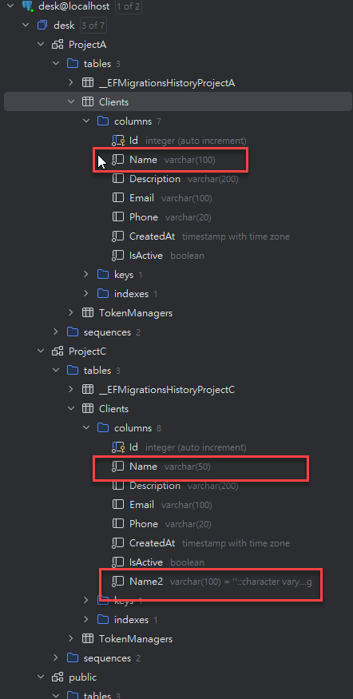

# EF Core DB Migration Schema 分離機制說明

## 概述

此專案使用 Entity Framework Core 搭配 PostgreSQL，透過 `appsettings.json` 中的 `CustomSchemaName` 設定，實現在同一個資料庫中使用不同 Schema 來區分各專案的資料表，達到資料邏輯分離的目的。

## 架構說明

### 1. 專案結構
- **ProjectA**: 負責客戶管理和權杖管理功能
- **ProjectB**: 負責郵件範本和簡訊設定功能

### 2. Schema 配置

#### ProjectA appsetting.json 配置
```json
{
  "CustomSchemaName": "ProjectA"
}
```

#### ProjectB appsetting.json 配置
```json
{
  "CustomSchemaName": ""
}
```

## 實作機制

### 1. Program.cs 中的 UseNpgsql 設定

兩個專案在 `Program.cs` 中都使用相同的模式來配置 PostgreSQL 連線和 Migration History Table：

#### Program.cs
```csharp
var customSchemaName = builder.Configuration["CustomSchemaName"];
builder.Services.AddDbContext<ProjectADbContext>(options =>
{
    if (!string.IsNullOrEmpty(customSchemaName))
    {
        //__EFMigrationsHistoryProjectA => 需自行替換
        options.UseNpgsql(connectionString,
            sqlOptions => sqlOptions.MigrationsHistoryTable("__EFMigrationsHistoryProjectA", customSchemaName));
    }
    else
    {
        options.UseNpgsql(connectionString,
            sqlOptions => sqlOptions.MigrationsHistoryTable("__EFMigrationsHistoryProjectA"));
    }
});
```

**重要設定說明**：
- **MigrationsHistoryTable**: 每個專案使用不同的 Migration History Table 名稱
  - ProjectA: `__EFMigrationsHistoryProjectA`
  - ProjectB: `__EFMigrationsHistoryProjectB`
- **Schema 分離**: 當有設定 `CustomSchemaName` 時，Migration History Table 也會放在對應的 Schema 中
- **避免衝突**: 不同的 History Table 名稱確保各專案的 Migration 記錄獨立管理

### 2. DbContext 設定

兩個專案的 DbContext 都採用相同的模式來處理 Schema 設定：

```csharp
protected override void OnModelCreating(ModelBuilder modelBuilder)
{
    // 直接從 Configuration 讀取 CustomSchemaName
    var customSchemaName = _configuration["CustomSchemaName"];
    if(!string.IsNullOrWhiteSpace(customSchemaName))
    {
        modelBuilder.HasDefaultSchema(customSchemaName);
    }

    base.OnModelCreating(modelBuilder);
    
    // 設定資料表名稱 (Schema 會透過 HasDefaultSchema 自動套用)
    modelBuilder.Entity<TableName>().ToTable("TableName");
}
```

### 3. 資料庫 Schema 結構

執行 Migration 後，資料庫結構如下：

```
PostgreSQL Database: desk
├── public schema (預設)
│   ├── MailTemplates (ProjectB)
│   ├── SMSConfigs (ProjectB)
│   └── __EFMigrationsHistoryProjectB (ProjectB Migration 記錄)
└── ProjectA schema
    ├── Clients (ProjectA)
    ├── TokenManagers (ProjectA)
    └── __EFMigrationsHistoryProjectA (ProjectA Migration 記錄)
```

### 4. Migration 生成結果

#### ProjectA Migration (使用 ProjectA Schema)
```csharp
protected override void Up(MigrationBuilder migrationBuilder)
{
    migrationBuilder.EnsureSchema(name: "ProjectA");

    migrationBuilder.CreateTable(
        name: "Clients",
        schema: "ProjectA",  // 明確指定 Schema
        // ... 欄位定義
    );
}
```

#### ProjectB Migration (使用預設 Schema)
```csharp
protected override void Up(MigrationBuilder migrationBuilder)
{
    migrationBuilder.CreateTable(
        name: "MailTemplates",
        // 沒有指定 schema，使用預設的 public schema
        // ... 欄位定義
    );
}
```

## 優點與效益

### 1. 邏輯分離
- 不同專案的資料表位於不同 Schema，避免命名衝突
- 清楚區分各專案的資料範圍

### 2. 權限管理
- 可針對不同 Schema 設定不同的存取權限
- 提升資料安全性

### 3. 維護便利
- 每個專案可獨立進行 Migration
- 不會影響其他專案的資料結構

### 4. 擴展性
- 新增專案時只需設定新的 `CustomSchemaName`
- 現有專案不受影響

### 5. 測試結果
- ProjectA 與 ProjecB 一個使用客製 Schema 一個使用預設 Schema 
  
- ProjectA 的 Entity 和 ProjectC 的 Entity 名稱相同，但是屬性與欄位大小不同，分別使用不同的 Schema 來避免衝突
  

## 注意事項

1. **Schema 名稱**: 建議使用專案名稱作為 Schema 名稱，保持一致性
2. **空值處理**: 當 `CustomSchemaName` 為空或 null 時，會使用預設的 public schema
3. **外鍵關聯**: 跨 Schema 的外鍵關聯需要特別注意權限設定
4. **備份還原**: 進行資料庫備份時需要包含所有 Schema

## 總結

此機制透過簡單的設定檔配置，實現了多專案共用資料庫但邏輯分離的目標。每個專案都能獨立管理自己的資料結構，同時維持整體架構的清晰性和可維護性。
